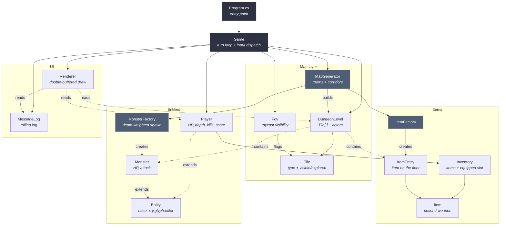

# Terminal Roguelike

A classic ASCII dungeon crawler in C# / .NET 10. Procedural rooms-and-corridors maps, fog of war, bump-to-attack combat, scaling monsters, endless descent. No external dependencies — just `System.Console`.

## Run it

```bash
dotnet run
```

Requires a real terminal (≥ **80×23**). The game uses `Console.ReadKey`, which doesn't work under piped stdin.

## Controls

| Key      | Action                          |
| -------- | ------------------------------- |
| Arrows   | Move (bump a monster to attack) |
| `Enter`  | Pick up item under you          |
| `f`      | Fire gun at adjacent primate    |
| `i`      | Open inventory (letter to use)  |
| `>`      | Descend stairs                  |
| `q`      | Quit                            |

## Glyphs

`🏃` rogue · `▓/▒` wall · `·/.` floor · `>` stairs down · `!` potion · `+` green energy · `/` weapon · `🔫` fire gun · `🐀 g o T W` monsters (rat → goblin → orc → troll → wraith) · `😈` evil primate

Bright tiles are in your field of view; dim tiles are explored but currently unseen.

## Visual Style

The terminal presentation uses a denser dungeon texture, a side panel with HP and gate status, and strong character colors: cyan for the player, magenta for the evil primate, and muted dungeon tones for the map.

## Primate Gate

Before play, the game shows a rule list one line at a time. Press `Enter` to reveal the next rule; the final `Enter` launches the dungeon.

Stand on a weapon and press `Enter` to collect it. Regular weapons equip automatically when they increase your attack power.

Stand on a green `+` and press `Enter` to restore 50% of your maximum energy. Descending to the next level restores your energy to full.

The first stairway is sealed. After you kill two rats, a stationary evil primate appears on the path to the stairs and blocks the narrow way forward. A `🔫` fire gun appears nearby; stand on it and press `Enter` to collect and equip it. Stand next to the evil primate and press `f` to shoot fire; the third fire blast kills it, unlocks the next level, and records the current score in `highscores.txt`.

## Architecture



### Turn loop


## Project layout

```
Program.cs            entry point
Game.cs               turn loop, input, combat, inventory screen, game over
Map/
  Tile.cs             TileType + visible/explored flags
  DungeonLevel.cs     grid + monster list + item list
  MapGenerator.cs     procedural rooms + L-shaped corridors
  Fov.cs              360-ray raycast field of view
Entities/
  Entity.cs           abstract base
  Player.cs           HP, attack, depth, kills, score, inventory
  Monster.cs          HP, attack, monster kind, optional hit-count health
  MonsterFactory.cs   depth-weighted spawn table
Items/
  Item.cs             Item + ItemEntity + ItemFactory
  Inventory.cs        list + equipped weapon slot
UI/
  Renderer.cs         double-buffered draw (only redraws changed cells)
  MessageLog.cs       rolling buffer of recent actions
```

## Notes

- Combat damage is `attacker.Attack + rng[-1, 1]`, minimum 1.
- Monsters only act while in the player's FOV; outside it they idle.
- Movement is 4-directional for both player and monsters; melee requires orthogonal adjacency.
- `Score = Depth × 100 + Kills × 10`. Top 10 runs persisted to `highscores.txt`.
