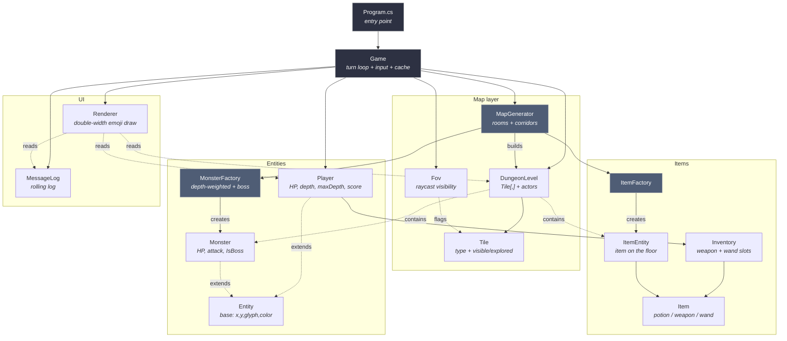
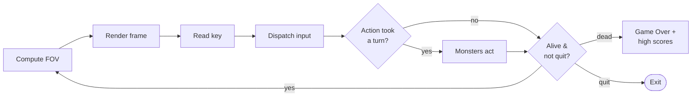
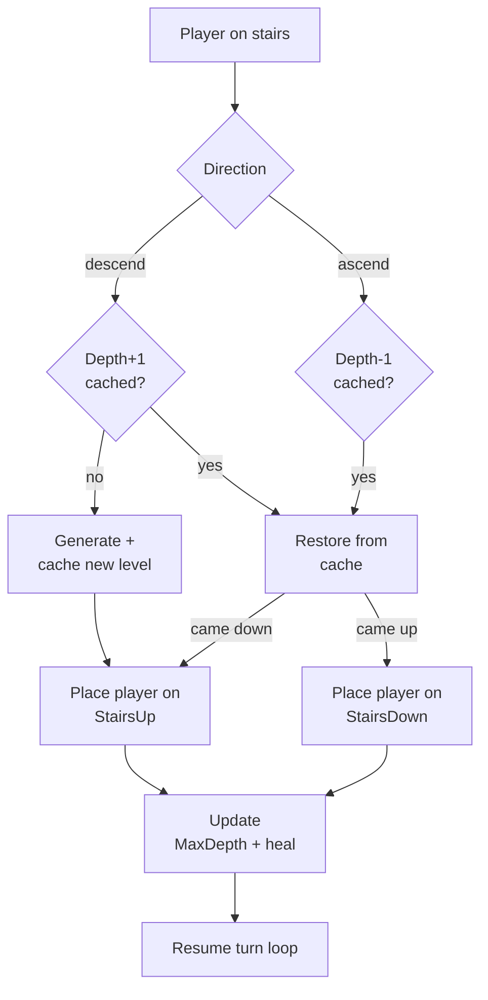

# Terminal Roguelike

An emoji-glyph dungeon crawler in C# / .NET 10. Procedural rooms-and-corridors maps, persistent multi-level dungeons, fog of war, bump-to-attack melee combat, ranged magic via wands, a boss requiring magic or enchanted steel, and endless descent for high scores. No external dependencies — just `System.Console`.

---

## Run

```bash
dotnet run
```

Requires a real terminal (≥ **80×23** cells). `Console.ReadKey` needs a TTY, so the game cannot be driven from piped stdin.

---

## Controls

### Main loop

| Key             | Action                                              | Consumes a turn? |
| --------------- | --------------------------------------------------- | ---------------- |
| `↑ ↓ ← →`       | Move one tile; bump into a monster to melee-attack  | yes              |
| `g` / `G`       | Pick up the item under you                          | yes (if item)    |
| `i` / `I`       | Open the inventory menu                             | no               |
| `z` / `Z`       | Zap your readied wand (opens direction prompt)      | yes (if fired)   |
| `>`             | Descend stairs (must be standing on a `>>` tile)    | yes              |
| `<`             | Ascend stairs (must be standing on a `<<` tile)     | yes              |
| `q` / `Q`       | Quit immediately (no save, no high-score entry)     | n/a              |
| any other key   | ignored                                             | no               |

Letter commands (`g`, `i`, `z`, `q`) are case-insensitive. The stair commands `>` and `<` are read by character, not key, so any keyboard layout that produces those characters works.

### Inventory menu (after pressing `i`)

| Key             | Action                                              |
| --------------- | --------------------------------------------------- |
| `a` … `t`       | Use/equip the item with that letter                 |
| any other key   | Cancel and return to the map                        |

Effects by item kind:
- **Healing potion** — drunk, removed from inventory, heals up to its amount (capped at MaxHp).
- **Weapon** — equipped to the weapon slot (replaces previous equipped weapon, which stays in inventory).
- **Wand** — readied in the wand slot (replaces previously readied wand).

### Zap prompt (after pressing `z`)

| Key             | Action                                              |
| --------------- | --------------------------------------------------- |
| `↑ ↓ ← →`       | Fire fireball in that direction (consumes 1 charge) |
| any other key   | Cancel — no turn, no charge spent                   |

Requires a readied wand with at least one charge; otherwise pressing `z` just logs a message and consumes nothing.

### Game-over screen

| Key             | Action                                              |
| --------------- | --------------------------------------------------- |
| any key         | Acknowledge death (then any key again to exit)      |

---

## Glyph reference

The map is 30 tiles wide × 18 tall, with each tile rendered as **2 terminal cells wide** to accommodate emoji.

### Tiles

| Glyph | Meaning           | Visible color | Dim (explored) color |
| ----- | ----------------- | ------------- | -------------------- |
| `██`  | Wall              | DarkCyan      | DarkBlue             |
| `··`  | Floor             | DarkYellow    | DarkGray             |
| `>>`  | Stairs down       | Yellow        | DarkYellow           |
| `<<`  | Stairs up         | White         | Gray                 |
| ⛲   | Fountain          | Cyan          | DarkCyan             |

### Actors and items

| Glyph | Name             |
| ----- | ---------------- |
| 🧙    | Player (you)     |
| 🐀    | Rat              |
| 👺    | Goblin           |
| 👹    | Orc              |
| 🧌    | Troll            |
| 👻    | Wraith           |
| 💀    | Dread knight (boss) |
| 🧪    | Healing potion   |
| 🗡️    | Weapon (any kind) |
| 🪄    | Wand of fireball  |
| 🔥    | Fireball projectile (animation only) |

Visible tiles render in full color; explored-but-not-visible tiles render dim (fog of war). Unexplored tiles render as blank space.

---

## Requirements

### Technical requirements

| Concern            | Value                                                       |
| ------------------ | ----------------------------------------------------------- |
| Language           | C# (modern, top-level statements in `Program.cs`)           |
| Framework          | .NET 10 (`net10.0`), `ImplicitUsings` + `Nullable` enabled  |
| External libraries | None                                                        |
| Output encoding    | UTF-8 (`Console.OutputEncoding = Encoding.UTF8`)            |
| Terminal size      | At least 80 cols × 23 rows                                  |
| Input              | `Console.ReadKey(true)` — real TTY only                     |
| Persistence        | `highscores.txt` next to the binary (top 10 runs)           |

### Game loop (turn-based)

Each iteration of the main loop:

1. **Compute FOV** — recursive 360-ray raycast from player position, radius 8 tiles. Sets each tile's `Visible` flag; `Explored` is sticky once set.
2. **Render** — draw map + entities + sidebar + log via a double-buffered renderer that only updates changed cells.
3. **Block on `Console.ReadKey(true)`** for player input.
4. **Dispatch input.** Action returns `tookTurn: bool`. Movement, attack, pickup, zap, descend/ascend each consume a turn; opening the inventory or pressing an unbound key does not.
5. **If turn was taken**, run monster AI.
6. **Loop** until player dies (`Hp <= 0`) or quits (`q`).

If the player dies, the final frame is rendered with the death message in the log, then the **Game Over** screen is shown with the final score and an updated high-score table.

### Map generation

- Per-floor procedural generation in `MapGenerator.Generate(width, height, depth, allowBossSpawn)`.
- Up to **30 placement attempts** for rectangular rooms (size 4–9 on each axis).
- Each new room is rejected if it intersects an existing one.
- After placement, each new room is connected to the previously placed room via an **L-shaped corridor** (random order: horizontal-then-vertical or vertical-then-horizontal).
- **Spawn**: first room's center is the player spawn / stairs-up location.
- **Stairs down**: last room's center, tile becomes `TileType.StairsDown`.
- **Stairs up**: depth > 1 only — first room's center, tile becomes `TileType.StairsUp`. Tracked via `level.HasStairsUp`.
- **Fountains**: per non-spawn room, 20% chance to place a `Fountain` tile at a random interior point (not on stairs).
- **Monsters**: per non-spawn room, `rng.Next(0, 2 + depth / 2)` monsters spawn (so depth scales count).
- **Items**: per non-spawn room, 60% chance for a primary item drop and an additional 20% chance for a bonus drop.
- **Boss**: at depth > 3, if no boss has been spawned in this run yet, 15% chance to place a dread knight in a random non-spawn room. Tracked via `Game._bossSpawned`; persists in the level cache.

### Level persistence

`Game` maintains a `Dictionary<int, DungeonLevel>` keyed by depth.

- **First visit to a depth**: generate, cache.
- **Revisit (up or down)**: pull from cache. Killed monsters stay dead, dropped items stay where they were, explored tiles stay explored.
- This prevents farming the upper floors (monsters do not respawn) and also makes the boss permanent on its floor until killed.
- The cache lives only in memory; quitting or dying discards it.

### Movement & combat

- **4-directional** movement for player and monsters (no diagonals).
- **Bump-to-attack**: walking into a monster's tile triggers melee. Damage = `attacker.Attack + rng[-1, 1]`, minimum 1.
- **Player attack stat**: `BaseAttack (4) + equipped weapon's AttackBonus`. Enchantment is a flag on the weapon (separate from the bonus).
- **Monster behavior**:
  - Only acts when in the player's FOV; otherwise idle (preserves state for level cache).
  - If orthogonally adjacent (`|dx| + |dy| == 1`), attacks for `monster.Attack ± 1`.
  - Otherwise steps toward the player on the axis with the greater distance, falling back to the other axis if blocked.
  - Cannot step onto another monster or onto the player without attacking.
- **Death**: monster removed from the level. Player death ends the game.

### Field of view

`Fov.Compute(level, px, py, radius)`:

- Resets `Visible` on every tile.
- Casts **360 rays** at evenly spaced angles around the player.
- Each ray marches up to `radius` (default 8) tiles, marking each `Visible` and `Explored`.
- A ray terminates after marking the first wall it hits (so wall faces are seen).

### Field elements

#### Stairs

- `>>` (descend) and `<<` (ascend) require `key == '>'` or `'<'` respectively AND the player standing on the matching tile.
- Descending to a new max depth grants +5 HP (clamped to MaxHp). Re-descending to an already-visited floor does not heal.
- Ascending from depth 1 is refused with a message ("You cannot leave the dungeon yet.").
- When entering a level via descent, the player lands on the destination's stairs-up if one exists, otherwise on the room-0 spawn.
- When entering via ascent, the player lands on the destination's stairs-down.

#### Fountains (`⛲`)

- Stepping onto a fountain attempts to **enchant your equipped weapon**.
- If no weapon equipped: log message, fountain unchanged.
- If weapon already enchanted: log message, fountain unchanged.
- Otherwise: weapon's `IsEnchanted` flag is set; player glyph color shifts to Yellow via `Player.UpdateAppearance()`; message logged.
- Fountains are single-use *per weapon* — but a fountain itself is not consumed, so re-stepping with a different weapon would still enchant. (Currently the only way to "lose" an enchantment is to drink a potion, which calls `UpdateAppearance()`. Equipped enchanted weapons are stable.)

### Items

- All items live in `Items.Item` with a `Kind` discriminator (`HealingPotion`, `Weapon`, `Wand`).
- An `ItemEntity` wraps an `Item` with map coordinates for items lying on the floor.

#### Drop probabilities (when an item spawns)

| Item kind          | Probability                                |
| ------------------ | ------------------------------------------ |
| Wand of fireball   | 15% at depth ≥ 2; 0% otherwise             |
| Healing potion     | 55% of the remaining roll                  |
| Weapon             | 45% of the remaining roll                  |

#### Healing potion

- Heals `10 + rng[0, 5]` HP, capped at `MaxHp`.
- Consumed on use (removed from inventory).

#### Weapon

- 5 tiered names: `dagger`, `shortsword`, `longsword`, `battle axe`, `warhammer`.
- `AttackBonus = 1 + depth/2 + rng[0, 1]`, clamped to choose the name from the tier table.
- Equipped to `Inventory.EquippedWeapon` slot. Replacing equipment is silent — old weapon stays in inventory.
- Can be enchanted by a fountain. Enchanted weapons display as `enchanted <name>` and can damage the boss.

#### Wand of fireball

- `WandDamage = 8 + depth/3`
- `WandRange = 6` tiles
- `Charges = 3 + rng[0, 2]`
- Equipped to a separate `Inventory.EquippedWand` slot.
- Zap mechanic (`z`):
  1. Refuse if no wand readied or charges == 0 (no turn consumed).
  2. Prompt "Zap which direction?" in the log, render to update display.
  3. Read next key; only arrow keys count. Non-arrow cancels (no turn, no charge consumed).
  4. Project a fireball in the chosen direction:
     - Steps tile-by-tile up to `WandRange`.
     - **Animation**: writes `🔥` at each step with a 40 ms pause (60 ms on wall impact).
     - On hitting a wall: log "bursts against the wall", spend a charge, end turn.
     - On hitting a monster: deals `WandDamage + rng[-1, 1]` damage. Kills increment `Player.Kills`. End turn.
     - If it travels the full range without hitting anything: "fizzles in the air", spend a charge, end turn.
  5. Boss rule bypass: fireballs are magic and damage the dread knight regardless of weapon enchantment.

### Inventory

- Capacity: 20 items.
- Pick-up (`g`) succeeds if there's an item on your tile and capacity remaining.
- Inventory screen (`i`):
  - Renders directly to the console (full-screen overlay).
  - Lists items as `a)`, `b)`, ... in their natural color, with details (heal amount, atk bonus, dmg/range/charges) and an `(equipped)` marker.
  - Pressing a matching letter triggers `UseItem` (consume potion, equip weapon, or ready wand).
  - Any other key cancels.
  - After closing, `_renderer.Reset()` forces a full redraw next frame.

### Bosses

- **Dread knight** (`💀`): Hp 45, Attack 11, `IsBoss = true`.
- Spawns once per run at depth > 3 (15% per generated floor until placed).
- Spawn announcement: "An ominous presence stalks this floor..." (DarkRed).
- **Damage immunity**: melee attacks bounce off unless the player's equipped weapon is enchanted. Log: "Your attack glances off the dread knight. Only enchanted steel can harm it!" — no turn cost.
- Fireballs always damage the boss.

### Scoring

`Score = MaxDepth × 100 + Kills × 10`

- `MaxDepth` is the deepest floor ever reached this run; ascending does not reduce it.
- High scores persist in `highscores.txt` as `score|depth|kills|iso-date` per line.
- The Game Over screen loads, appends the new run, sorts descending, truncates to 10, and rewrites the file. Malformed lines are silently skipped on load.

### Rendering

- **Logical map**: 30 × 18 tiles. **Physical render**: each tile = 2 columns wide. Sidebar adds 20 cols. Total = 80 × 23 cells.
- **Buffer**: `string[80, 23]` for glyphs + `ConsoleColor[80, 23]` for colors. Trailing half-cells of 2-wide glyphs are stored as `""` and skipped on flush.
- **Double-buffer diff**: only cells whose glyph or color changed since the last frame are redrawn. Eliminates flicker.
- **Sidebar layout** (column 60 onward, rows 0–17):
  - Row 0: `-- STATUS --`
  - Row 1: `Depth: X (max Y)`
  - Row 2: `HP: X/Y` (red ≤⅓, yellow ≤⅔, green otherwise)
  - Row 3: `ATK: X`
  - Row 4: `Kills: X`
  - Row 5: `Score: X`
  - Row 7: `-- KEYS --`
  - Rows 8–14: 7 key hints (arrows, g, i, z, >, <, q)
  - Row 15: `Weapon:`
  - Row 16: equipped weapon name (or `(fists)`)
  - Row 17: `Wand: <name (charges)>` or `(none)`
- **Log**: rows 18–22, top row is a divider of `-` chars. Log holds up to 4 messages; oldest scroll off.
- **Transient overlay** (`DrawTransient`): used for the fireball animation. Writes directly to the terminal at a tile coordinate and updates the prev-buffer so the next render correctly restores the underlying tile.

---

## Architecture



### Turn loop



### Level transition



---

## Project layout

```
Program.cs            entry point — sets UTF-8 output and runs Game
Game.cs               turn loop, input dispatch, combat, inventory UI,
                      level cache, ascend/descend, zap, game over
Map/
  Tile.cs             TileType (Wall, Floor, StairsDown, StairsUp, Fountain)
                      + Visible / Explored flags
  DungeonLevel.cs     2D Tile grid + Monsters list + Items list +
                      StairsUp/StairsDown/PlayerSpawn coords
  MapGenerator.cs     procedural rooms + L-shaped corridors,
                      monster/item/fountain/boss placement
  Fov.cs              360-ray raycast field-of-view
Entities/
  Entity.cs           abstract base (X, Y, Glyph, Color, Name)
  Player.cs           HP, attack, depth, maxDepth, kills, score,
                      inventory, appearance update on enchantment
  Monster.cs          HP, attack, IsBoss flag
  MonsterFactory.cs   depth-weighted spawn pool + CreateBoss
Items/
  Item.cs             Item + ItemEntity + ItemFactory (probabilities)
  Inventory.cs        items list + equipped weapon + equipped wand
UI/
  Renderer.cs         double-buffered, double-width emoji-aware draw
  MessageLog.cs       rolling buffer of recent messages
```

---

## Caveats & known limitations

- **`Console.ReadKey(true)` requires a real TTY.** The game cannot be smoke-tested from a script or piped stdin — only by running it in an interactive terminal.
- **Terminal must be ≥ 80 × 23.** Smaller windows cause `Console.SetCursorPosition` to throw `ArgumentOutOfRangeException`.
- **Emoji width depends on the terminal.** All glyphs assume each emoji renders 2 cells wide (iTerm2, macOS Terminal, Windows Terminal, modern Linux terminals). On terminals that render emoji as 1 cell wide, the layout will misalign.
- **No save/load**, only high scores. Quit (`q`) and death both end the run.
- **No diagonal movement** for any actor. Diagonally adjacent monsters must step before attacking.
- **High-score file is plain text** (`score|depth|kills|iso-date`). Easy to edit by hand; malformed lines are skipped silently on load.
- **Fountains aren't consumed.** Stepping on one with an unenchanted weapon enchants it; with an enchanted weapon nothing happens. This means a second pass with a different weapon would still enchant.
- **The boss check is per-run, not per-cache.** Once a boss has been placed on any floor in the run, no other floor will spawn another, even if you never visited the boss's floor — this is intentional but worth noting.
